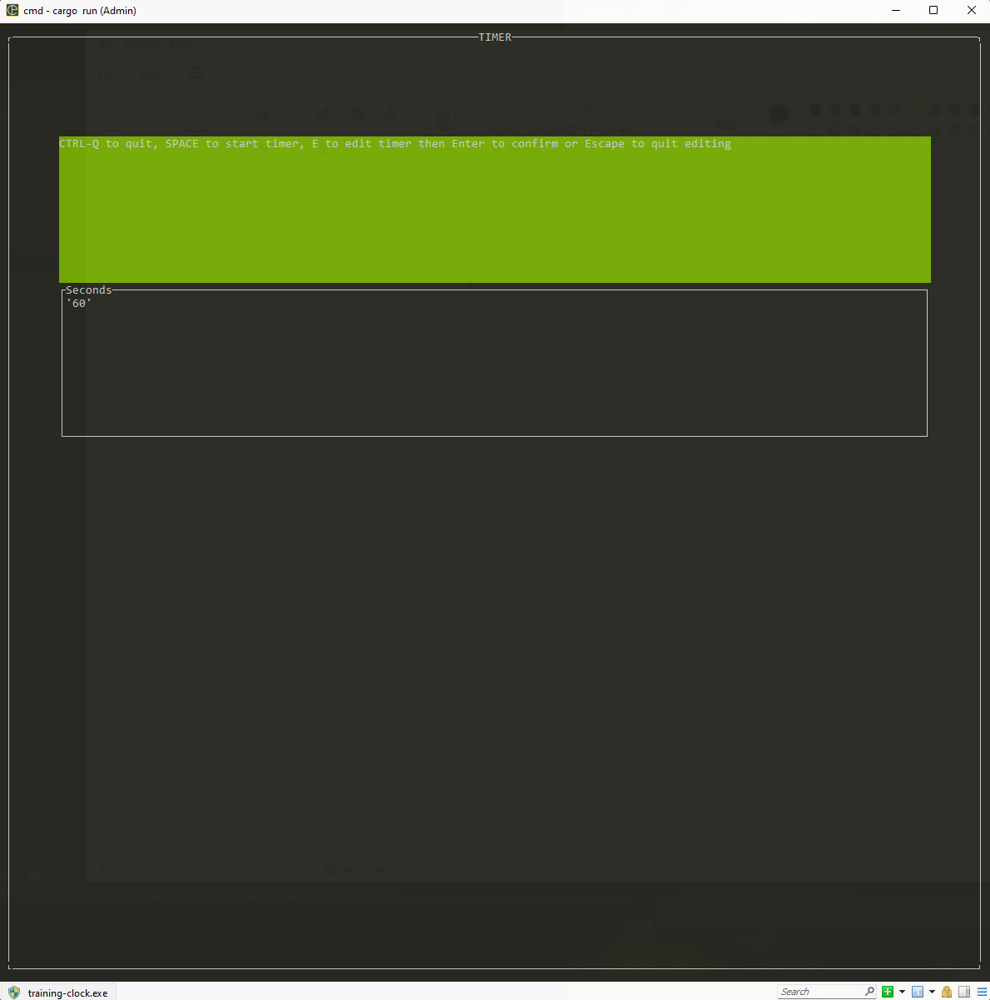
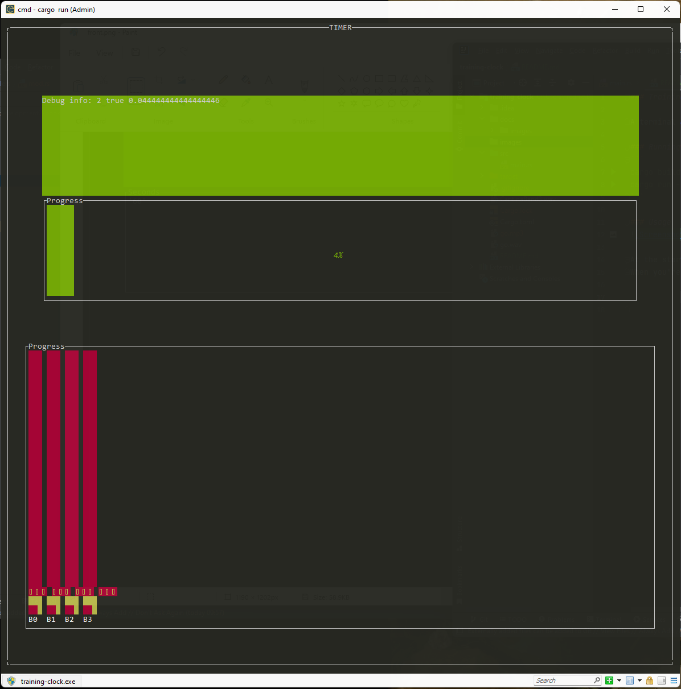

### Training clock

A terminal app for running a training clock with the aim to be simple

### Running
```
cargo build --release
cargo run --release
```

### Usage


At the start screen you tap E to enter edit mode and type the amount of seconds that you want the timer to run. 
When you're happy you hit Enter and Space to start the timer




The timer starts running and upon finish plays `go.wav`. 
To start the timer again hit Space again

To quit hit CTRL-Q (does not work while the timer is running)